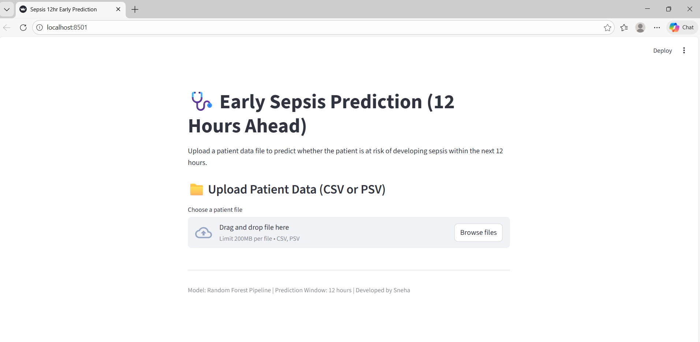
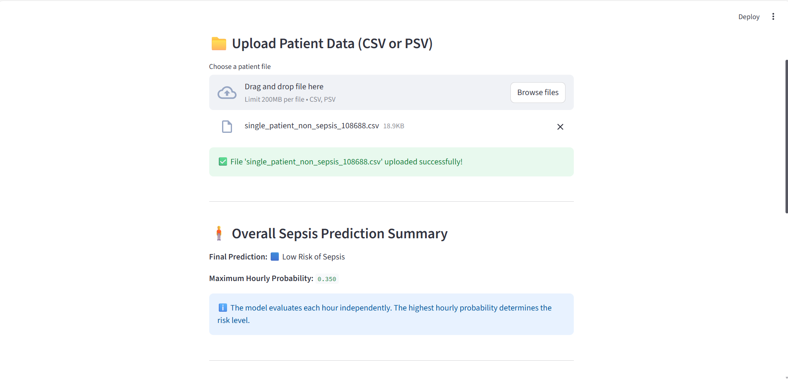
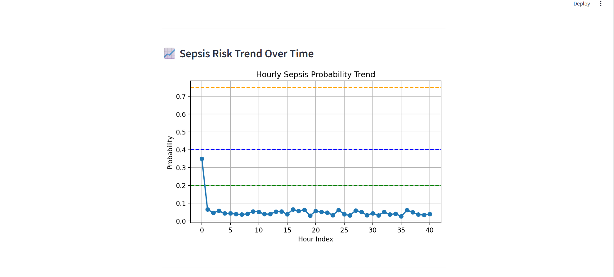
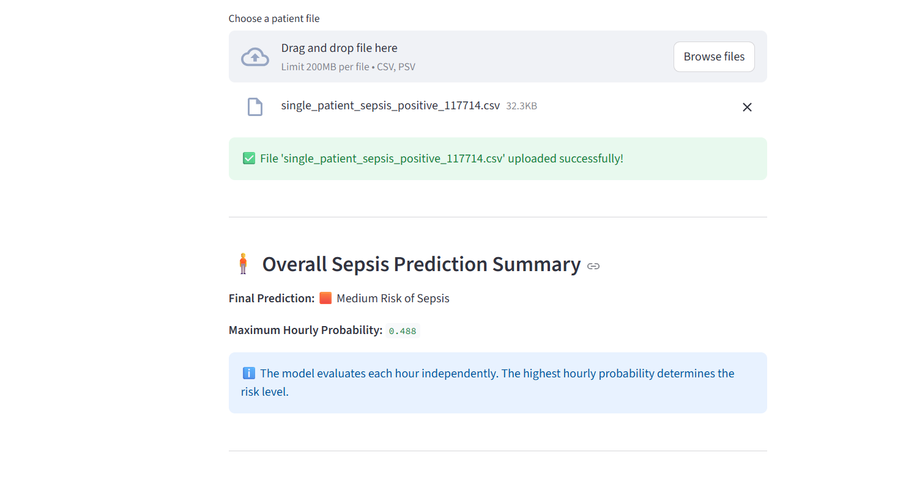
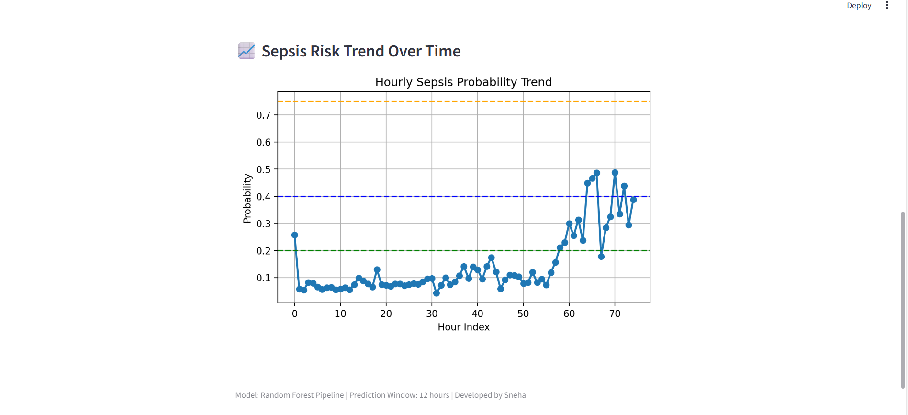
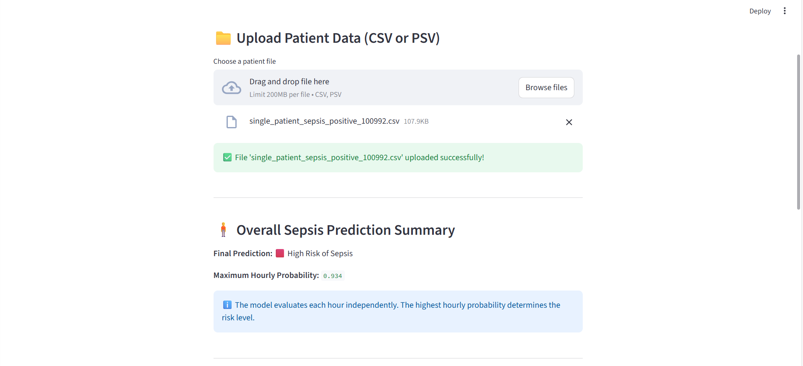
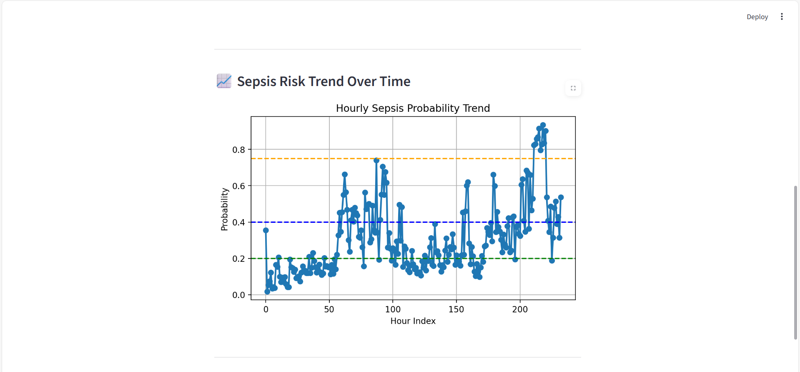

# 🩺 Sepsis Early Prediction (12 Hours Ahead)

This project presents a machine learning–based system to predict the early onset of sepsis **12 hours in advance** using patient vital signs and laboratory parameters. The trained model is deployed through a Streamlit web application to support real-time clinical risk assessment.

---

## 📌 Problem Statement
Sepsis is a life-threatening medical condition caused by the body’s extreme response to infection. Delayed diagnosis can result in organ failure and increased mortality. Traditional rule-based systems often detect sepsis late. This project aims to provide **early and accurate prediction** using machine learning techniques.

---

## 🚀 Proposed Solution
- Machine learning–based early sepsis prediction
- Random Forest classifier for robust performance
- Handles class imbalance using SMOTE
- Pipeline-based preprocessing (scaling + model)
- Interactive Streamlit web application

---

## 🧠 Machine Learning Workflow
1. Data cleaning and preprocessing  
2. Feature scaling using StandardScaler  
3. Class imbalance handling with SMOTE  
4. Model training using Random Forest  
5. Model evaluation (Accuracy, F1-score, AUC)  
6. Deployment using Streamlit  

---

## 📂 Project Structure

Sepsis_Early_Prediction_12hr/
├── app.py
├── models/
├── notebooks/
├── data/
├── screenshots/
├── README.md
└── .gitignore


---

## 🧪 Input Features
- Heart Rate (HR)
- Temperature
- Mean Arterial Pressure (MAP)
- Oxygen Saturation (O₂Sat)
- Respiratory Rate
- WBC
- Creatinine
- Platelets
- Statistical features (mean, std, diff)

---

## 📊 Output
- Sepsis probability score
- Risk classification:
  - 🟩 No Risk
  - 🟦 Low Risk
  - 🟧 Medium Risk
  - 🟥 High Risk
- Hourly probability trend visualization

---

## 🖥️ Streamlit Application

---

## 📸 Application Screenshots

### 🏠 Home Page


---

### 🟦 Low Risk Prediction
**Prediction Output**


**Probability Trend**


---

### 🟧 Medium Risk Prediction
**Prediction Output**


**Probability Trend**


---

### 🟥 High Risk Prediction
**Prediction Output**


**Probability Trend**



### ▶️ Run Locally
```bash
pip install -r requirements.txt
streamlit run app.py

 Note on Large Files:

Due to GitHub file size limitations, large datasets and trained model files are not included in this repository.
They can be regenerated by running the training notebooks.

🔮 Future Enhancements

1.Deep learning models (LSTM, GRU)
2.Explainable AI (SHAP)
3.Real-time ICU monitoring
4.Cloud deployment

👩‍💻 Developed By

Sneha 
MCA – Sepsis Early Prediction Project